# Labelme Operation

## **Installation**

### **Labelme.exe**

[Labelme Official Github](https://github.com/wkentaro/labelme)

> Labelme桌面版应用安装

<div align="center">
    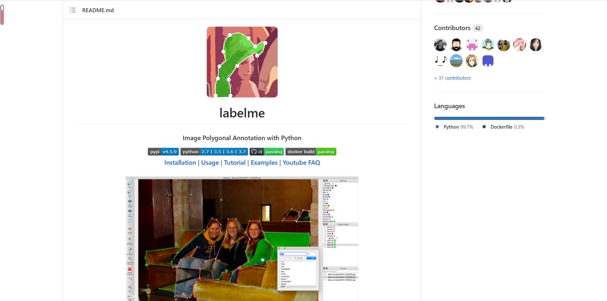
</div>

<div align="center">
    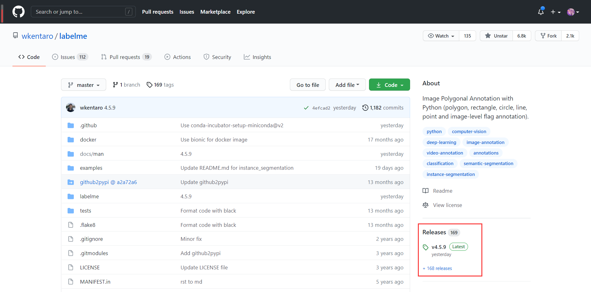
</div>

<div align="center">
    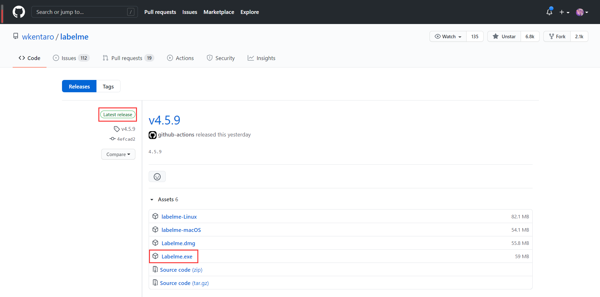
</div>

- **Latest Release下找到Labelme.exe直接点击下载后双击即可打开进行图片标注**

### **Labelme Python-Package**

> Labelme还提供了Python-Package供安装，可以更方便进行一些可视化以及调用

1. **安装Python：Python的安装网上有很多资料，参照网上的资料安装即可，这里不再赘述（需要Python3.6或更高版本）**

2. **打开CMD命令行（或PowerShell），执行下列命令安装Labelme**

    ```shell
    python -m pip install labelme
    ```

    **安装完成即可**

## **Annotation Visualization**

> **如果需要对刚标注完成的图片进行可视化查看标注效果，按如下操作：**

1. **打开需要可视化的.json文件所在文件夹，左上角文件-打开PowerShell，如下图所示：**

    <div align="center">
        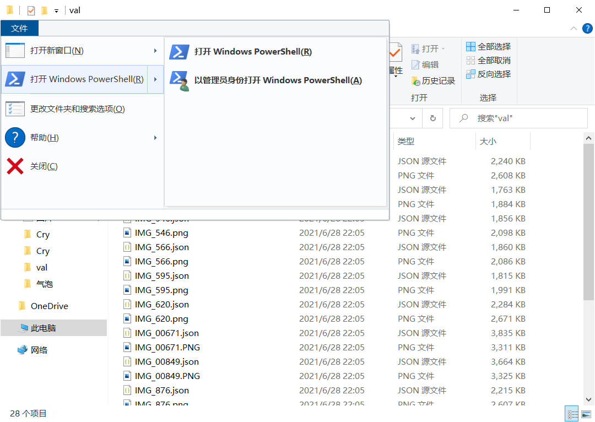
    </div>

2. **输入如下命令即可：**

    ```shell
    labelme_draw_json xxx.json
    ```

    <div align="center">
        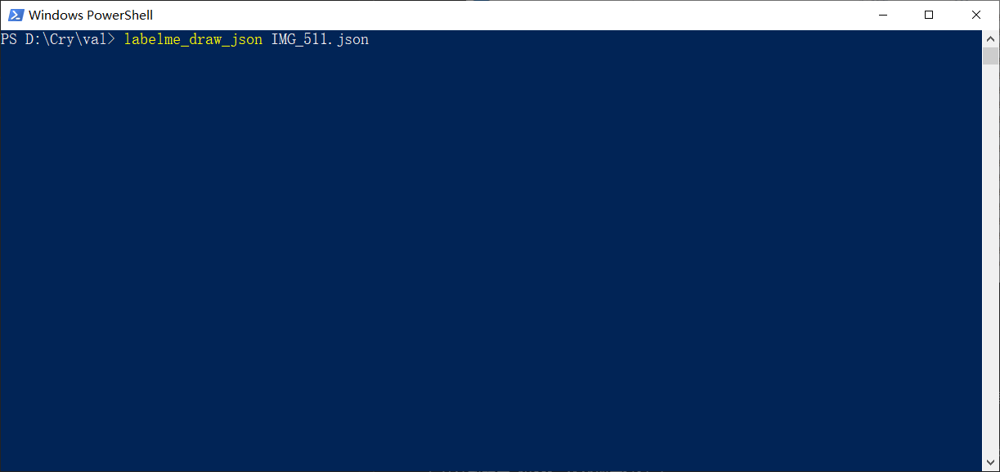
    </div>


# Environment Setup

> **本部分说明环境配置**

## **GPU Setup**

> GPU配置

1. **需要一张显存大于4GB的NVIDIA显卡，如GTX 1080、RTX 2080等等**

2. **安装CUDA、CUDNN等必要的工具包和显卡驱动，这里仅简要阐述CUDA和CUDNN安装，其余可在网上查询，在此不再赘述**


### **CUDA Installation**

[CUDA Official](https://developer.nvidia.com/cuda-toolkit-archive)

> **CUDA安装**

- **点击如上链接安装即可**

### **CUDNN Installation**

[CUDNN Official](https://developer.nvidia.com/rdp/cudnn-archive)

> **CUDNN安装**

- **点击如上链接安装即可**

- **注意：CUDNN是严格和CUDA版本适配的，请选择适配的版本**

- **下载完成后解压复制出里面lib、bin、include三个文件夹到CUDA的默认安装目录C:\Program Files\NVIDIA GPU Computing Toolkit\CUDA\v11.4（注意这里是合并文件，不是覆盖文件）**


## **Python-Package Installation**

> **本部分阐述必要的Python包安装**

- **本项目所有需要的Python已导出在txt文件里，在项目文件夹根目录中打开CMD或PowerShell执行如下命令即可一次性安装：**

    <div align="center">
        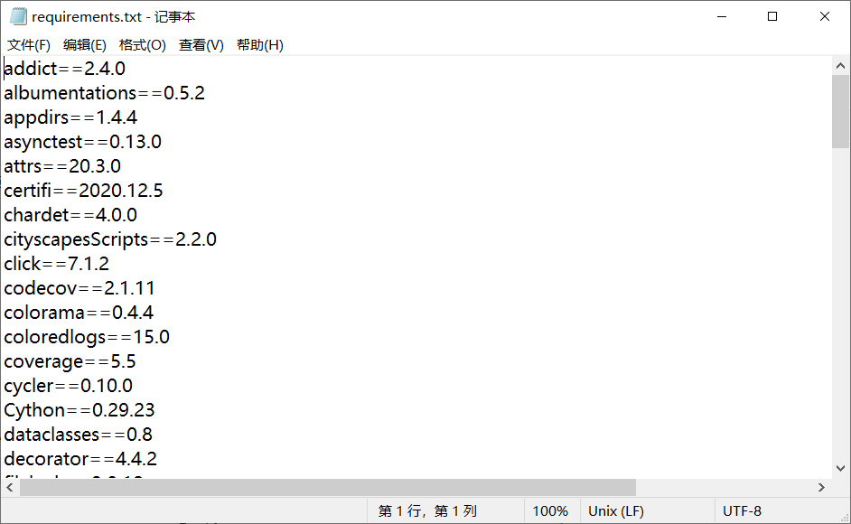
    </div>
    
    
    ```shell
    python -m pip install -r requirements.txt
    ```

## **mmdetection Installation**


[mmdetection Official Github](https://github.com/open-mmlab/mmdetection)

> **本部分阐述mmdetection安装**

1. 首先是确保上面的python包全部安装完成

2. 安装mmcv-full包，该包需要安装前面环境中的所有python包

    ```shell
    pip install mmcv-full
    ```
    如果无法直接安装，说明需要说明torch和cuda对应版本来进行安装
    ```shell
   pip install mmcv-full -f https://download.openmmlab.com/mmcv/dist/{cu_version}/{torch_version}/index.html
   ```
    具体填写方法如下
    ```shell
    pip install mmcv-full -f https://download.openmmlab.com/mmcv/dist/cu110/torch1.7.0/index.html
    ```
3. 解压之前发送的mmdetection.zip，或者是直接从github上面clone

4. 进行mmdetection文件夹本身的编译
    ```shell
    python setup.py develop
    ```

5. 将较大的权重文件dict文件进行下载并且移动到mmdetection/work_dirs/mask_rcnn_r50_caffe_fpn_mstrain-poly_1xSF下
    >链接：https://pan.baidu.com/s/18dWehstHxixFbIP93sNesg 提取码：bb6r 

# Project Directory Structure & Introduction

- **first_datset：训练集（包括图片和标注文件）**

- **val：测试集**

- **detect.py：单张图片检测**

- **video_detect.py：视频检测**

- **ana.py：晶体分析**

- **auto_annotation.py：渐进式标注**

- **count.py：类别计数**

- **generate_json.py：训练配置文件**

## **Train**

> **本部分简要阐述模型训练过程**

1. **训练图片以及标注放在first_datset文件夹下**

2. **执行如下命令生成训练配置文件：**

    ```shell
    python generate_json.py
    ```

3. **执行如下命令开始训练：**

    ```shell
    cd mmdetection
    python tools/train.py configs/mask_rcnn_r50_caffe_fpn_mstrain-poly_1xSF.py
    ```


## **Detect**

> **本部分主要阐述模型检测过程**

### **Single Image Detect**

> **单张图片检测（detect.py）**

- **参数介绍：**

    + **--config_file：模型配置文件路径**

        + **默认值："./mmdetection/configs/mask_rcnn_r50_caffe_fpn_mstrain-poly_1xSF.py"**

        + **一般不作修改**

    + **--checkpoint_file：模型权重文件路径**

        + **默认值："./mmdetection/work_dirs/mask_rcnn_r50_caffe_fpn_mstrain-poly_1xSF/latest.pth"**

        + **一般不作修改**

    + **--img_file：待检测图片路径**

        + **需要手动指定**

    + **--out_file：输出的检测图片路径**

        + **默认值：./c5.jpg**

        + **可根据需要修改**

    + **--score_thre：置信度阈值**

        + **默认值：0.4**

        + **可根据需要修改**

    + **--nms_thre：nms阈值**

        + **默认值：0.3**

        + **可根据需要修改**

    + **gpu_id：GPU代号**

        + **默认值：0**

        + **可根据需要修改（可通过nvidia-smi命令查看）**


- **示例：**

    + **单张图片检测：**

        ```shell
        python detect.py --img_file ./val/IMG_511.png --out_file ./out.jpg
        ```

        <div align="center">
            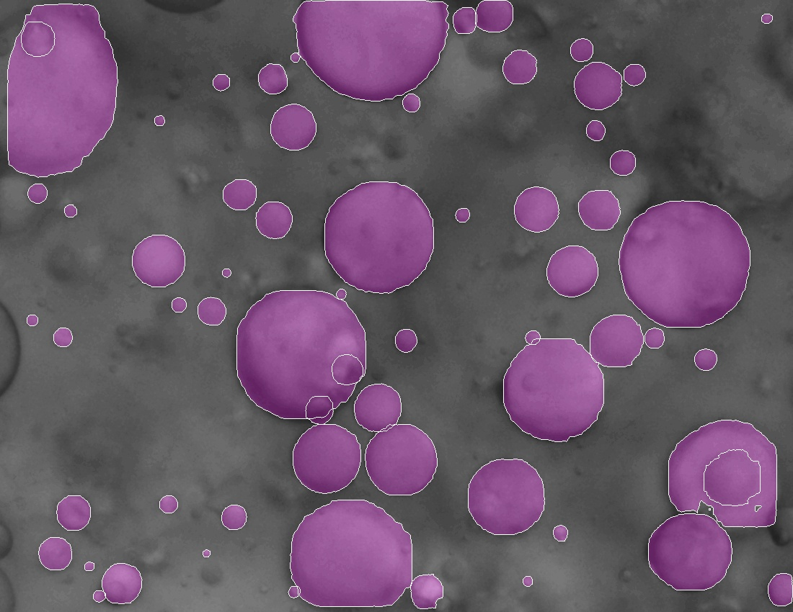
        </div>

### **Video Detect**

> **视频检测（video_detect.py）**

- **本部分需要GUI界面配合测试以及开发，故尚未测试**


## **droplet analysis **

> **液滴分析（ana.py），需要先对待分析图片执行detect.py进行检测后再执行此文件**

- **参数介绍：**

    + **--img_file：待分析图片路径**

        + **需要手动指定**

    + **--out_file：输出的椭圆拟合图片路径**

        + **默认值：./ellipse.png**

        + **可根据需要修改**

    + **--result_file：detect.py文件生成的result.npy文件路径**

        + **默认值：./result.npy**

        + **一般不作修改**

    + **--scale：比例尺（单个像素点所对应的长度，单位微米）**

        + **默认值：5 / 9**

        + **可根据需要修改**


- **示例：**

    + **单张图片分析：**

        ```shell
        python detect.py --img_file ./val/IMG_511.png --out_file ./out.jpg
        
        python ana.py --img_file ./val/IMG_511.png
        ```

        <div align="center">
            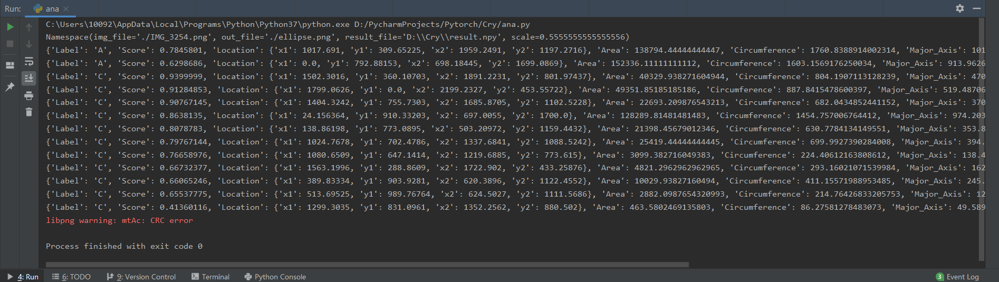
        </div>

    

## **Auto Annotate**

> **自动渐进式标注**

- **参数介绍：**

    + **--dir_path：待标注图片文件夹路径**

        + **需要手动指定**

    + **--score_thre：置信度阈值**

        + **默认值：0.4**

        + **可根据需要修改**

    + **--nms_thre：nms阈值**

        + **默认值：0.3**

        + **可根据需要修改**


- **示例：**

    + **批量图片自动标注：**

        ```shell
        python auto_annotation.py --dir_path ./TEST
        ```

    + **执行完上述命令后，生成的标注.json都在文件夹下，此时可通过如下命令打开Labelme进行渐进式标注：**

        ```shell
        labelme xxx.jpg -O xxx.json
        ```

        <div align="center">
            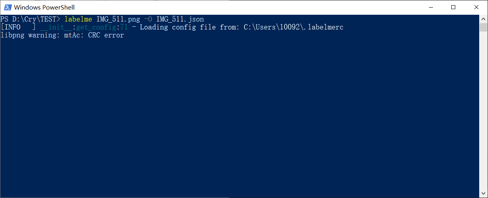
        </div>

        <div align="center">
            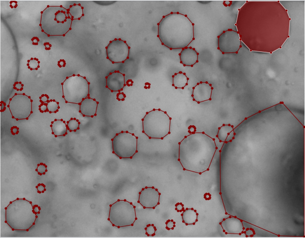
        </div>


## **Count**

> **类别计数**

- **参数介绍：**

    + **--dir_path：待标注图片文件夹路径**

        + **需要手动指定**


- **示例：**

    + **类别计数：**

        ```shell
        python count.py --dir_path ./first_datset
        ```

        <div align="center">
            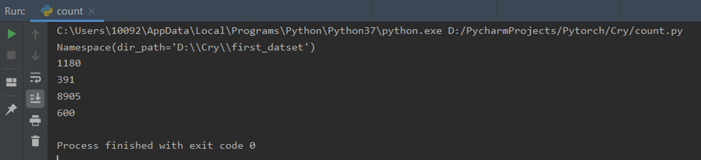
        </div>

备注：
1.	split_image.py，用于对图像进行裁剪，以实现image patching-based training
2.	visualize_shape reconstruction.py，将其名称改为visualize.py并运行，即可实现液滴形状重建
3.	文件名以“batch”为开头的.py文件，可以实现批量检测 (batch_detect.py)、可视化 (batch_visualize.py)、和分析 (batch_ana.py)
